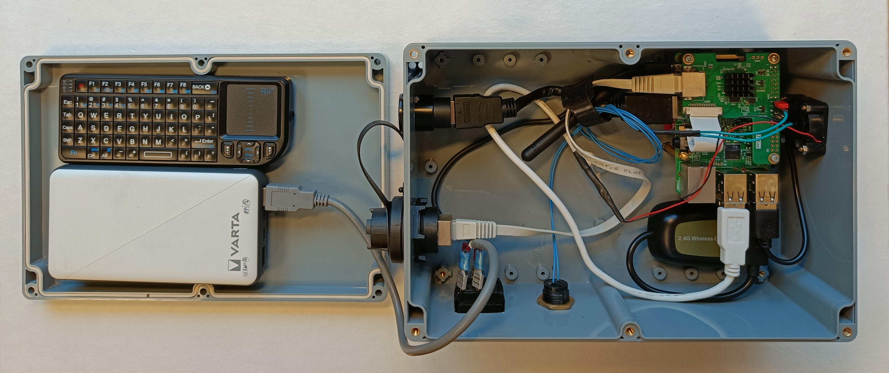

# Assemblage µKOSMOS

  
 Sommaire 

  
  1. [Assemblage du boitier électronique](assemblage_µkosmos.md#1-assemblage-du-boitier-électronique)
  2. [Assemblage du caisson vidéo](assemblage_µkosmos.md#2-assemblage-du-caisson-vid%C3%A9o)
  3. [Assemblage du trépried](assemblage_µkosmos.md#3-assemblage-du-tr%C3%A9pried)
  4. [Assemblage du casque](assemblage_µkosmos.md#4-assemblage-du-casque)
  5. [Assemblage du câble](assemblage_µkosmos.md#5-assemblage-du-câble)
  6. [Assemblage de la paravane](assemblage_µkosmos.md#6-assemblage-de-la-paravane)
      

## 1. Assemblage du boitier électronique

  
 Outils 

  
  * gaine thermo {[Etape 1](assemblage_µkosmos.md#etape-1---réaliser-les-raccordements-entre-les-câbles-et-les-connecteurs)}
  * matériel soudure {[Etape 1](assemblage_µkosmos.md#etape-1---réaliser-les-raccordements-entre-les-câbles-et-les-connecteurs)}
  * couronne de forage (diamètre:...) {[Etape 3](assemblage_µkosmos.md#etape-3---percer-les-côtés-du-boitier)}
  * foret (diametre: ..) {[Etape 3](assemblage_µkosmos.md#etape-3---percer-les-côtés-du-boitier)}
  * perceuse {[Etape 3](assemblage_µkosmos.md#etape-3---percer-les-côtés-du-boitier)}
  * velcro {[Etape 4 et 5](assemblage_µkosmos.md#etape-4---fixer-le-receiver-gaming-la-carte-gps-et-le-ventilateur-dans-la-boite)}
  * tourne vis plat 
  * tourne vis cruciforme
  

  
 Materiel 

  
  [Tableau matériel boitier électronique](materiel_boitier_electronique.md)
    

### Etape 1 - Réalisation les raccordements entre les câbles et les connecteurs

### Relier un câble USB à un câble micro USB en passant par le commutateur 

> [!NOTE]
> Ce câble fera le lien entre la batterie et la Raspberry et permetta d'alimenter la carte. Le commutateur permet de couper le courant sans débrancher les câbles.

> [!TIP]
> Optionel : connecteur cosse  
> Ici des connecteurs cosses ont été utilisés mais ils ne sont pas obligatoires vous pouvez simplement réaliser des soudures entre les pins et les câbles
> 
> Il est également important de noté que le commutateur peut lui aussi être modifié, vous aurez seulement besoin d'un intérupteur avec auto maintient (qui reste dans sa position losrque l'on appui dessus)

- couper le câble USB à une trentaine de centimètre du branchement USB  
- enfiler la gaine thermo sur le câble (elle sera chauffée à la fin)  
- utiliser les connecteurs cosses pour faire le lien entre les pins du commutateur et le câble USB, brancher le fil noir et le fil rouge  
- chauffer la gaine thermo pour recouvrir tous les fils  
- répéter les mêmes étapes que pour le côté avec le câble micro USB et le commutateur

 

### Relier un câble USB au ventillo

> [!NOTE]
> Ce câble fera le lien entre le ventilateur et la raspberry. Brancher le ventilateur sur la carte pemet de l'alimenter et de le faire fonctionner.

- couper le câble USB à une trentaine de centimètre du branchement USB  
- enfiler la gaine thermo sur le câble (elle sera chauffée à la fin)   
- souder les câbles rouges ensemble et les câbles noirs ensemble  

### Relier des câbles de prototypage au bouton poussoir  

> [!NOTE]
> Ces câbles feront le lien entre le bouton poussoir et la raspberry.

- répéter les mêmes étapes que pour le câble USB et le ventillo  

### Etape 2 - assemblage de la carte ethernet et de la carte raspberry  

> [!NOTE]
> La carte Ethernet est nécessaire pour ""

- monter les supports sur la raspberry
- souder barette noire
- brancher carte ethernet sur raspberry
- connecter les "trames"

  

### Etape 3 - Perçage des côtés du boitier 

> [!NOTE]
> Ces ouvertures permettront de placer les connecteurs.

> [!TIP]
> Réaliser une ouverture supplémentaire pour que l'air puisse circuler et refroidir le système
>
> Si votre boitier est différent réfléchisser à la meilleur manière de l'organiser à l'intérieur

- percer des trous pour les connecteurs et pour les vis qui les fixeront
  

### Etape 4 - Fixation du receiver gaming, de la carte gps et du ventilateur dans le boitier

> [!TIP]
> Optionnel: velcro
> le velcro permet de ne pas coller définitivement les composants mais il est optionnel. Il peut être remplacer.

- fixer le receiver gaming et la carte gp à l'aide de velcro
- visser le ventilateur
- brancher le câble micro USB sur la carte gps, il sera difficile d'accès lorsque la carte raspberry sera fixée
  

 ### Etape 5 - Fixation du clavier et de la batterie dans le couvercle  
 - fixer le clavier et la baatterie à l'aide de velcro

### Etape 6 - Fixation de la raspberry au boitier

### Etape 7 - Fixation de l'interrupteur, du bouton poussoir, des connecteurs et réalisation des branchements

## 2. Assemblage du caisson vidéo

  
 Outils 

  
  * ex1
  * ex2
  

  
 Materiel 

  
  [Tableau matériel caisson vidéo](materiel_caisson_video.md)
    

## 3. Assemblage du trépried

  
 Outils 

  
  * imprimante 3D {[Etape 1](assemblage_µkosmos.md#etape-1---impression-3d)}
  * foret M3, M6 {[Etape 2](assemblage_µkosmos.md#etape-2---assemblage-de-la-partie-inf%C3%A9rieur-du-tr%C3%A9pied)}
  * meuleuse {[Etape 2](assemblage_µkosmos.md#etape-2---assemblage-de-la-partie-inf%C3%A9rieur-du-tr%C3%A9pied)}

  
 Materiel 

  
  [Tableau matériel trépied](materiel_trepied.md)
    

### Etape 1 - Impression 3D
Imprimer les pièces inférieur et supérieur du socle ainsi que les pièces de maintient du caisson vidéo.

### Etape 2 - Assemblage de la partie inférieur du trépied
 - Découpé le tube en aluminium de manière à obtenir trois segment d'environ "50cm"
 - Couper les extrémitées de chaque segment en biais à environ 45° pour qu'ils puissent se poser à plat en étant inclinés "en bas" et prendre moins de place "en haut"
 - Percer les tubes avec un foret de 6mm à environ 20cm de la partie basse (un peu plus que la longueur du plomb que vous avez choisi) et avec un foret de 3mm à environ 2cm de la partie haute et un autre à 10cm de la partie haute. Les trous doivent traversés le tube de part et d'autre pour pouvoir y insérer des vis.
 - Percer les plombs avec un foret M3 perpendiculairement au trou déjà existant. Ce trou permettra de faire passer le serre câble pour maintenir la partie basse du plomb sur le tube.
 - Fixer les plombs sur la partie basse des tubes. Viser et Ajouter un serre câble comme ci-dessous.
  

 - Couper le tête des clous, insérer les dans le trou réaliser à 10cm de la partie haute et plier les bords qui dépasse contre le tube. "Ces clous permette de bloquer la partie inférieur du socle en translation."  

 - Insérer la partie haute des tubes dans le socle inférieur du trépied imprimé en 3D  
 - Faire passer un fil de fer dans les trous réaliser à 2cm de la partie haut. "Ils servitront à éviter les translation vers le haut de la partie inférieur du socle.   

  
### Etape 3 - Assemblage de la partie supérieur du trépied
 - Coller les bande de mousse à l'intérieur des bers. Attention à laisser les trous prévu pour les vis libres.
 - Percer 2 trous dnas la plaque métalique avec un foret M4 et un trou avec un foret M10. Il faut que les trous correspond aux trous déjà présent au centre sur le socle supérieur imprimé
 - Positionner la plaque métallique au dessus de la partie supérieur du socle et fixer l'anneau d'accroche M10 à la partie supérieur du socle.  

 - Viser le ber supérieur à la partie supérieur du socle avec des vis M4  

 - Viser le "ber inférieur" pour former le support du caiso vidéo. Pas besoin deserrer pour le moment si vous n'avez pas insérer le caisson.

### Etape 4 - Assemblage de la partie haute et de la partie basse du trépied
 - Découper la tige filetée de manière à avoir 2 segments de 170mm et 4 segements de 145mm
 - inserrer des écrous nylstop de chaque côté des tiges filetées  

 - Lors du montage des écrous placer des rondelles de chaque côté de la pièce imprimer pour la protéger. Insérer les tiges filetée dans le socle inférieur puis viser un écrou avec oreilles en dessous.  

 - Insérer des rondelles sur les tiges puis positionner la partie supérieur du socle. Ajuster les écrous de manière à ce que le socle vienne se poser horizontallement.
 - Comme pour la partie basse fixer le haut avec des écrous à oreilles
   
   [imagefinale]
   
## 4. Assemblage du casque

  
 Outils 

  
  * ex1
  * ex2
  

  
 Materiel 

  
  [Tableau matériel casque](materiel_casque.md)
    

### Etape 1 - Impression 3D
Imprimer les pièces de suport de l'écran ainsi que celles du support de batterie.

### Etape 2 - Assemblage écran
 - Visser l'écran à sont support
 - Mettre de la mousse sur les diagonales du support d'écan
 - brancher un cable micro usb

### Etape 3 - Percer la coque extérieur du casque
 - Réaliser une ouverture sur le haut du casque pour pouvoir accéder à la prise hdmi de l'écran
 - Percer également l'avant de la coque pour pouvoir viser la partie basse du support de la batterie.

### Etape 4 - Assemblage de la batterie
 - Mettre de la mousse sur les diagonales du support inférieur et supérieur de la batterie (on peut aussi en ajouter à l'intérieur si la baterie bouge, mais pas trop pour ne pas qu'elle chauffe)

 - Visser la partie basse du support de la batterie au casque
 - placer la batterie à l'intérieur
 - visser la partie supérieur du supporrt pour le fermer

### Etape 5 - Asssemblage final
 - Mettre l'écran dans le casque
 - fermer le casque
 - brancher le cable hdmi et relier le cable usb à la batterie

## 5. Assemblage du câble

  
 Outils 

  
  * ex1
  * ex2
  

  
 Materiel 

  
  [Tableau matériel câble](materiel_cable.md)
    

## 6. Assemblage de la paravane

  
 Outils 

  
  * ex1
  * ex2
  

  
 Materiel 

  
  [Tableau matériel paravane](materiel_paravane.md)
    

    
