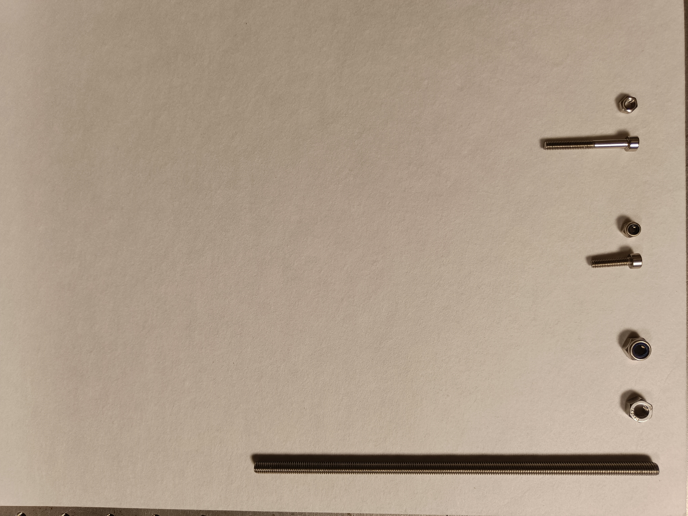

# Materiel Boite
## Outils:

## Visserie:
| Visuel | Référence | Quantité | Dénomination | Usage | Conseil |
|-------:|-----------|----------|--------------------------|-----------------------------------------|----------|

## Cable:
| Visuel | Référence | Quantité | Dénomination | Usage | Conseil |
|-------:|-----------|----------|--------------------------|-----------------------------------------|----------|
|        |           |         1| petit ethernet           |                                         |          |
|        |           |         1| rallonge HDMI 10cm       |                                         |          |

## Connecteur:
| Visuel | Référence | Quantité | Dénomination | Usage | Conseil |
|-------:|-----------|----------|--------------------------|-----------------------------------------|----------|
|        |           |         1| bulgin HDMI              |                                         |          |
|        |           |         1| raccord ethernet/boite   |                                         |          |

## Electronique:
| Visuel | Référence | Quantité | Dénomination | Usage | Conseil |
|-------:|-----------|----------|--------------------------|-----------------------------------------|----------|
|        |           |         1| batterie 15Ah            |                                         |          |
|        |           |         1| boitier 240*160*90       |                                         |          |
|        |           |         1| bouton poussoir vert     |                                         |          |
|        |           |         1| clavier                  |                                         |          |
|        |           |         1| commutateur              |                                         |          |
|        |           |         1| kit d'extension ethernet |                                         |          |
|        |           |         1| raspberry PI4 4GB        |                                         |          |
|        |           |         1| ventillateur 5V          |                                         |          |

 
 
