# Materiel Boite
## Outils:

## Visserie:
| Visuel | Référence | Quantité | Dénomination | Usage | Conseil |
|-------:|-----------|----------|--------------------------|-----------------------------------------|----------|
|        |           |         6|écrou M4                  |                                         |          |
|        |           |         9|vis M4                    |Permet de fixer le ventilateur, la Raspberry, et le bulgin HDMI |          |
|        |           |         6|vis M6  longueur:         |Permet la fermeture du boitier étanche             |          |
|        |           |         4|"vis support hexagonale"  |Permet de surelever la carte                             |          |

## Cable:
| Visuel | Référence | Quantité | Dénomination | Usage | Conseil |
|-------:|-----------|----------|--------------------------|-----------------------------------------|----------|
|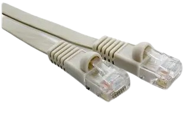   |[VIDEK 2966-0.3F](https://fr.farnell.com/videk/2966-0-3f/lead-flat-cat6-utp-beige-0-3m/dp/1515103?ost=1515103)  |         1|ethernet 0.3m           | "Relie carte ethernet au raccord ethernet/boite"   |          |
|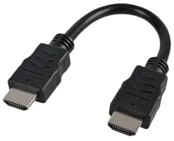        |[PRO SIGNAL PSG91337](https://fr.farnell.com/pro-signal/psg91337/hdmi-lead-black-0-15m/dp/3400642?ost=3400642)|         1| rallonge HDMI 10cm       | Relie la raspberry au bulgin HDMI   |          |
|        |           |         2|cable USB           | Relie la batterie au commutateur    Relie le ventillateur à la carte |Récup    Seul le connecteur usb est important l'autre bout du cable sera coupé et relier à d'autre petit cable par soudure    |
|        |           |         1|cable USB vers USB           | Relie la raspberry à la carte gps   |Récup     |
|        |           |         1|cable "fin vert"           | Relie bouton poussoir à carte ethernet   |Récup     |

## Connecteur:
| Visuel | Référence | Quantité | Dénomination | Usage | Conseil |
|-------:|-----------|----------|--------------------------|-----------------------------------------|----------|
|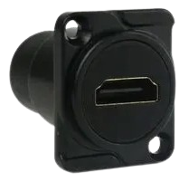        |[AMPHENOL AUDIO AC-HDMI-RRB](https://fr.farnell.com/amphenol/ac-hdmi-rrb/adaptateur-hdmi-type-d-fem-fem/dp/2951361?ost=ac-hdmi-rrb) |         1| bulgin HDMI              | "connect la boite au casque de Réalité Virtuelle (VR)"|          |
|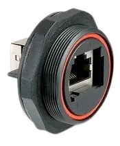        |[BULGIN LIMITED PX0839/90](https://fr.farnell.com/bulgin/px0839-90/connecteur-coupleur-cat5e-horizontal/dp/1687567?ost=px0839%2F90) |         1| raccord ethernet/boite   | "connect la boite au cable" |          |
|        |           |         1| connecteur       |Connecte deux pin de la carte ethernet pour chager le mode de fonctionnement            |          |
|        |           |         4|connecteur cosse            | Fait le lien entre les pins du commutateur et les câbles                     |          |

## Electronique:
| Visuel | Référence | Quantité | Dénomination | Usage | Conseil |
|-------:|-----------|----------|--------------------------|-----------------------------------------|----------|
|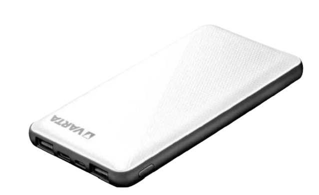        |[Varta 57977 101 111](https://fr.rs-online.com/web/p/batteries-externes/2309825?gb=s)           |         1| batterie 15Ah            |Alimente la raspberry    |          |
|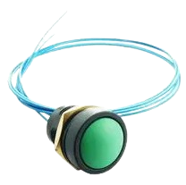        |[ITW SWITCHES 49-59113](https://fr.farnell.com/itw-switches/49-59113/commutateur-rond-vert/dp/734093?ost=734093)   |         1| bouton poussoir vert     |""            |          |
|        |           |         1| carte gps + antenne          |""                                         |          |
|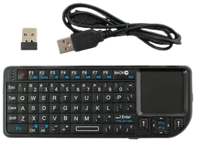        |[ADAFRUIT 922](https://fr.farnell.com/adafruit/922/miniature-wireless-usb-keyboard/dp/2301653?st=keyboard)|         1| clavier + USB + cable    |Permet de modifier le code sur place si besoin           |à éviter au maximum          |
|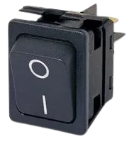        |[ARCOLECTRIC (BULGIN LIMITED) C6050ALAAC](https://fr.farnell.com/arcolectric/c6050alaac/commutateur-a-bascule-dpst-noir/dp/7674155)|         1| commutateur + cache étanche             |Permet d'allumer et d'éteindre le système     |          |
|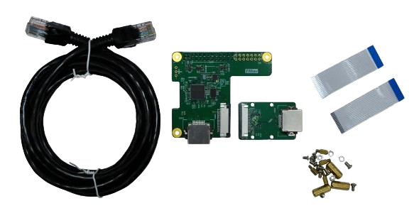        |[THine Solutions, Inc. THSER101](https://fr.rs-online.com/web/p/hat-et-complements-raspberry-pi/2206246?redirect-relevancy-data=7365617263685F636173636164655F6F726465723D31267365617263685F696E746572666163655F6E616D653D4931384E53656172636847656E65726963267365617263685F6D617463685F6D6F64653D6D61746368616C6C7061727469616C267365617263685F7061747465726E5F6D6174636865643D5E2E2A24267365617263685F747970653D43415443485F414C4C5F44454641554C54267365617263685F7370656C6C5F636F72726563745F6170706C6965643D59267365617263685F77696C645F63617264696E675F6D6F64653D4E4F4E45267365617263685F6B6579776F72643D5448696E6520536F6C7574696F6E732C20496E632E204361626C6520457874656E73696F6E204B697420666F72205261737062657272792050692043616D267365617263685F6B6579776F72645F6170703D5448696E6520536F6C7574696F6E732C20496E632E204361626C6520457874656E73696F6E204B697420666F72205261737062657272792050692043616D26)           |         1| kit d'extension ethernet |""              |          |
|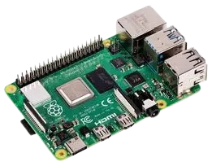        |[RASPBERRY-PI RPI4-MODBP-4GB](https://fr.farnell.com/raspberry-pi/rpi4-modbp-4gb/raspberry-pi-4-model-b-4gb/dp/3051887?st=rpi4) |         1| raspberry PI4 4GB        |"contient le programme de fonctionnement de la camera"     |          |
|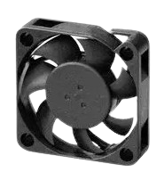        |[MULTICOMP MC002684](https://fr.farnell.com/multicomp/mc002684/ventilateur-40x40x10mm-5vdc/dp/3050784) |         1| ventilateur 5V          |permet de refroidir le système      | "attention fait beaucoup de bruit"          |
|        |          |         1| Wireless graming receiver     |Permet de faire le lien avec la manète de Xbox                |          |

## Autre pièce:
| Visuel | Référence | Quantité | Dénomination | Usage | Conseil |
|-------:|-----------|----------|--------------------------|-----------------------------------------|----------|
|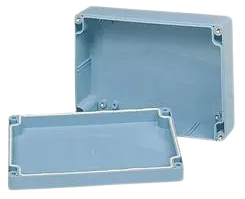        |[MULTICOMP PRO G3008](https://fr.farnell.com/multicomp/g3008/boitier-abs-240x160x90mm-ip65/dp/1526644?st=boitier%20ip65%20240%20mm)|      1| boitier 240 * 160 * 90       |Abrite les élément électroniques de manière étanche        |          |
|        |           |        4| pied                                   |Permet d'avoir la boite à plat          |Récup     |
|        |           |     10cm| gaine thermo retractable    |"fait le liaison entre les différents câbles assemblés"          |Récup       |

(Les images proviennent des sites constructeurs)
