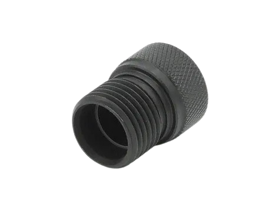
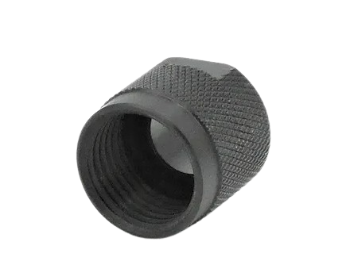
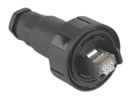
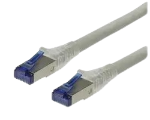
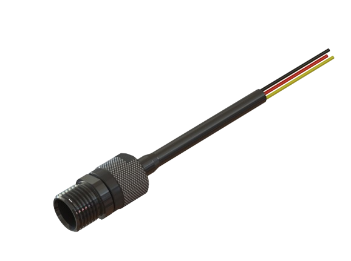

# Matériel Cable

## Visserie:
| Visuel | Référence | Quantité | Dénomination | Usage | Conseil |
|-------:|-----------|----------|--------------------------|-----------------------------------------|----------|
|        |           |         1| anneau d'accroche M10 A4 |Permet d'attacher un bout au micro kosmos |          |

## Connectique:
| Visuel | Référence | Quantité | Dénomination | Usage | Conseil |
|-------:|-----------|----------|--------------------------|-----------------------------------------|----------|
|        |[COB-1003](https://www.bluetrailengineering.com/product-page/cobalt-series-dummy-cap)          |         1|capuchon protection cable       | Permet de protéger le cable lorsqu'il n'est pas utilisé                    |          |
|        |[COB-1001](https://www.bluetrailengineering.com/product-page/low-profile-locking-sleeve)          |         1|fermeture capuchon protection       |Permet de protéger le cable lorsqu'il n'est pas utilisé                         |          |
|   |[BULGIN LIMITED PX0834/B](https://fr.farnell.com/bulgin/px0834-b/connecteur-precable-rj45/dp/9667733?st=bulgin%20px0834/b)           |         1| connecteur ethernet          |Permet d'avoir un contact parfait avec le tube pexy|          |

## Cable:
| Visuel | Référence | Quantité | Dénomination | Usage | Conseil |
|-------:|-----------|----------|--------------------------|-----------------------------------------|----------|
|   |[ROLINE 	21.15.0871](https://fr.farnell.com/roline/21-15-0871/cordon-de-brassage-rj45-m-m-30m/dp/3003054?ost=21.15.0871)         |         1| cable ethernet 15m         |Permet ""   |          |
|        |[COB-1681-SS](https://rov-expert.fr/blue-trail-engineering/525-cobalt-8-pin-male-connector-on-1-meter-cable-single-ended.html)          |         1|cable 8pin      | Fait le lien entre ... et ...                        |          |

