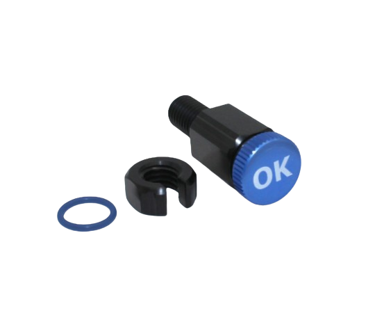
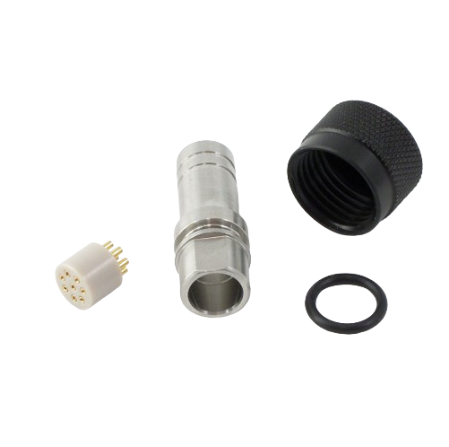
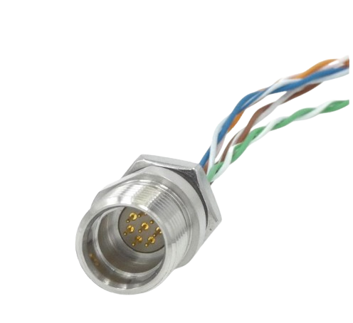
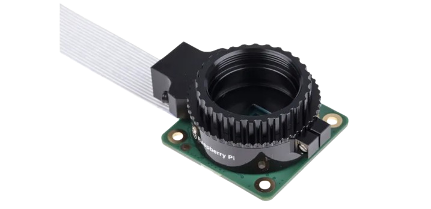
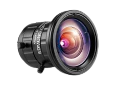
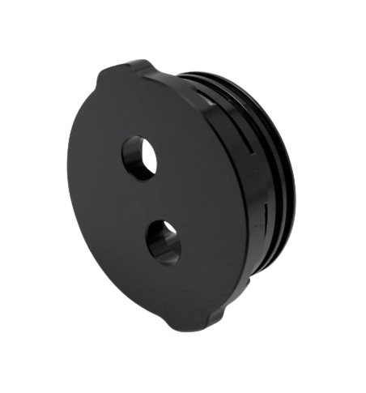
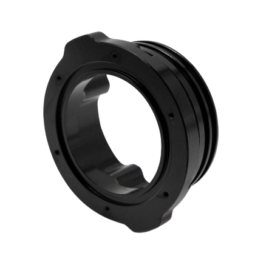
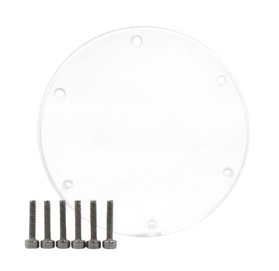
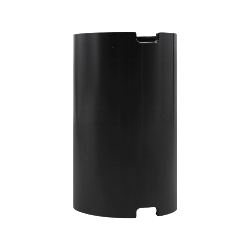
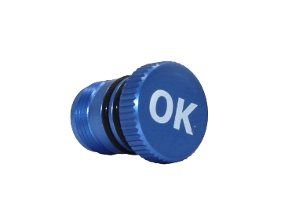

# Materiel caisson idéo
## Outils:

## Visserie:
| Visuel | Référence | Quantité | Dénomination | Usage | Conseil |
|-------:|-----------|----------|--------------------------|-----------------------------------------|----------|
|        |           |         4|écrou                  |                                         |          |
|        |           |         12|écrou                  |                                         |          |
|        |           |         4|vis                  |                                         |          |
|        |           |         4|vis                  |                                         |          |

## Connecteur:
| Visuel | Référence | Quantité | Dénomination | Usage | Conseil |
|-------:|-----------|----------|--------------------------|-----------------------------------------|----------|
|        |[BR-100804](https://bluerobotics.com/store/cables-connectors/penetrators/vent-asm-r1/)           |         1| connecteur de la valve de pression         |"Permet de purger le dispositif"                         |          |
|        |[COB-3180-SS](https://bluerov-solutions.com/produkt/cobalt-series-cable-termination-kit-regular/)          |         1|8 pin terminaison kit       |Protège le connecteur lorsque le cable n'est pas branché  Une partie du kit est utiliser sur la cable                         |          |
|        |[COB-138C-SH](https://rov-expert.fr/blue-trail-engineering/498-cobalt-8-pin-connector-on-custom-length-cable-double-ended-shielded.html)        |         1| Connecteur 8 pin           |Permet de faire le lien avec le "cable" et la carte de la PiCam              |          |

## Electronique:
| Visuel | Référence | Quantité | Dénomination | Usage | Conseil |
|-------:|-----------|----------|--------------------------|-----------------------------------------|----------|
|        |[Raspberry Pi SC0261](https://fr.rs-online.com/web/p/cameras-pour-raspberry-pi/2012852?gb=s)        |         1| Camera raspberry Pi (Pi Cam)           |Camera compatible avec la carte Rasberry Pi             |          |
|        |[TECHSPEC Objectif à distance focale fixe série UC 4mm](https://www.edmundoptics.fr/p/4mm-uc-series-fixed-focal-length-lens/2966/)  |         1| Objectif 4mm     |Permet d'améliorer les performance de la Pi Cam            |          |

## Mécanique:
| Visuel | Référence | Quantité | Dénomination | Usage | Conseil |
|-------:|-----------|----------|--------------------------|-----------------------------------------|----------|
|        |[BR-100276-002](https://bluerobotics.com/store/watertight-enclosures/locking-series/wte-end-cap-vp/)          |         1| 2'' Flange Cap Aluminium 2 * M   hole       |Ferme le bas du tube, les deux ouverture permettrons de mettre la valve de pression et le connecteur 8pin                    |          |
|        |[BR-100628-998](https://bluerobotics.com/store/watertight-enclosures/2-series/wte-flange-vp/)          |         1| 2'' O-Ring Flange       |Ferme le haut du tube                         |          |
|        |[BR-100094](https://bluerobotics.com/store/watertight-enclosures/2-series/wte-end-cap-vp/)          |         1| 2'' End Cap Acrylic       |S'assemble sur O-Ring Flange pour fermer le haut du tube                         |          |
|        |[BR-100534-100](https://bluerobotics.com/store/watertight-enclosures/locking-series/wte-locking-tube-r1-vp/)           |         1| tube étanche     diametre: 50mm  longueur: 100mm  + 2 socles         |Abrite l'installation de la camera             |          |
|        |[BR-100783](https://bluerobotics.com/store/cables-connectors/penetrators/vent-asm-r1/)          |         1|valve de pression M10       | valve qui vient se fermer le connecteur                 |          |

## Impresion 3D:
| Visuel | Référence | Quantité | Dénomination | Usage | Conseil |
|-------:|-----------|----------|--------------------------|-----------------------------------------|----------|
|        |[support]()|      1|              |                                |          |

(Les images proviennent des sites constructeurs)
