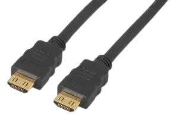
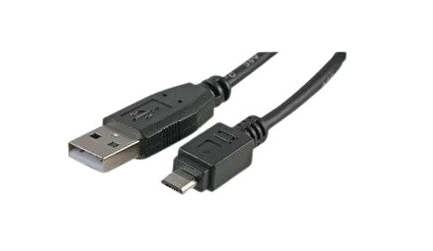
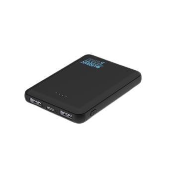
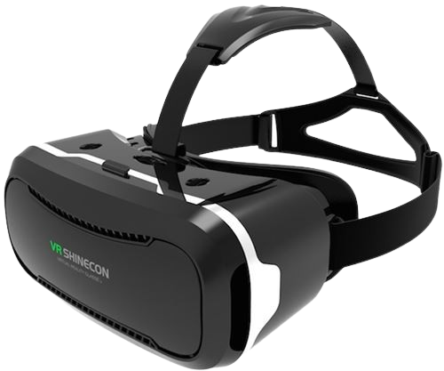
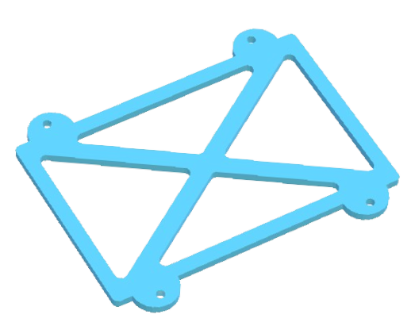
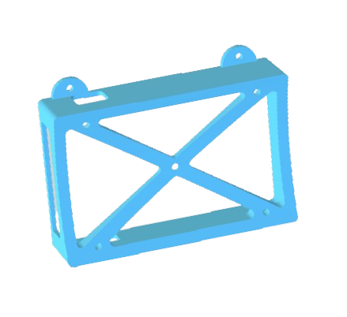
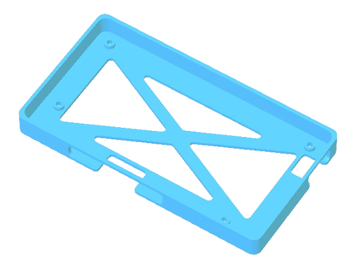

# Materiel Casque

## Visserie:

>[!Note]
>Pour désigner les spécificitées d'une vis on utilise des lettres. Ici la lettre M signifie que la vis à un filetage métrique (ISO). Le chiffre qui suit le M correspond au diamètre en mm. La veleur d'après correspond à la longueur du filetage de la vis.

| Visuel | Référence | Quantité | Dénomination | Usage | Conseil |
|-------:|-----------|----------|--------------------------|-----------------------------------------|----------|
|        |           |         9|écrou M2                  |                                         |          |
|        |[RS PRO 914-1624](https://fr.rs-online.com/web/p/vis-a-metaux/9141624)           |         4|vis M2*4mm                |Fixer le l'ecran du casque à son support              |          |
|        |[RS PRO 526-906](https://fr.rs-online.com/web/p/vis-a-metaux/0526906)           |         5|vis M2*6mm                |Fixer le boitier de la batterie au casque             |          |
|        |[RS PRO 914-1475](https://fr.rs-online.com/web/p/vis-a-metaux/9141475)           |         4|vis M2*8mm                |Fixer le couvercle du boitier de la batterie          |          |

## Cable:
| Visuel | Référence | Quantité | Dénomination | Usage | Conseil |
|-------:|-----------|----------|--------------------------|-----------------------------------------|----------|
|        |[MIGRIP-HDMI-5](https://fr.farnell.com/clever-little-box/migrip-hdmi-5/cable-hdmi-male-male-verrouillage/dp/2373729)           |         1|câble hdmi                | Relie le casque au boitier électronique |          |
|        |[KUB06861-NR](https://www.kubii.com/fr/alimentations/1501-1088-mini-cable-blanc-usb-micro-usb-kubii-3272496003491.html#/couleur-noir)           |         1|câble micro usb - USB     | Relie l'écran à la batterie             |          |

## Electronique:
| Visuel | Référence | Quantité | Dénomination | Usage | Conseil |
|-------:|-----------|----------|--------------------------|-----------------------------------------|----------|
|        |[Urban Factory UPB05UF](https://www.fnac.com/Batterie-externe-Urban-Factory-UPB05UF-Juicee-Max-Powerbank-5000-mAh-Noir/a16416729/w-4#omnsearchpos=4)       |         1| Batterie 500mAh           |Alimente l'écran du casque de VR            |          |
|        |[EAN 3002637644654](https://www.fnac.com/mp33894226/Casque-VR-pour-Smartphone-Realite-Virtuelle-Lunette-Jeux-Reglage-Universel/w-4#omnsearchpos=1)     |         1| Casque de réalité virtuelle          |permet de visualiser les image de la caméra             |Vous pouvez utiliser un simple écran, mais avec le soleil dehors les écrans sont souvent illisibles. Le casque permet de voir correctement les images;          |

## Impresion 3D:
| Visuel | Référence | Quantité | Dénomination | Usage | Conseil |
|-------:|-----------|----------|--------------------------|-----------------------------------------|----------|
|        |[support_top_batterie](/../µKOSMOS/hardware/3Dprint_files/casque/Support_batterie_BOT.stl)|      1| Support supérieur batterie             |Partie haute de la boite dans laquelle la batterie sera maintenue                           |          |
|        |[support_bot_batterie](/../µKOSMOS/hardware/3Dprint_files/casque/Support_batterie_TOP.stl)|      1| Support inférieur batterie              |Partie basse de la boite dans laquelle la batterie sera maintenue                           |          |
|           |[support_ecran](/../µKOSMOS/hardware/3Dprint_files/casque/Support_ecran.stl)|      1|Support de l'écran        |boite dans laquelle l'ecran sera maintenue                           |          |

## Autre:
| Visuel | Référence | Quantité | Dénomination | Usage | Conseil |
|-------:|-----------|----------|--------------------------|-----------------------------------------|----------|
|        |[mousse]()|      1|Mousse             |""                                |          |

(Les images proviennent des sites constructeurs)
