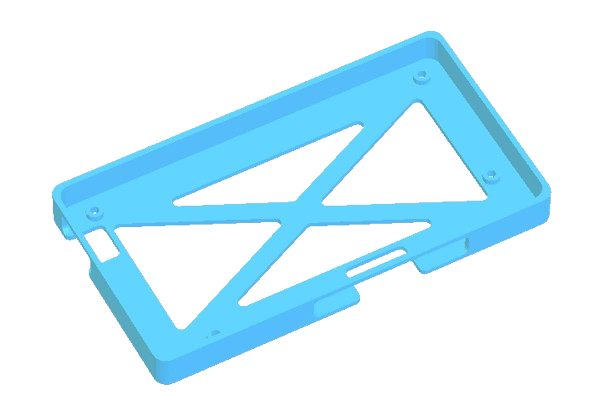

# materiel casque
## Outils:

## Visserie:
| Visuel | Référence | Quantité | Dénomination | Usage | Conseil |
|-------:|-----------|----------|--------------------------|-----------------------------------------|----------|
|        |           |         9|écrou M2                  |                                         |          |
|        |           |         4|vis M2*4mm                |Fixer le l'ecran ducasque à son support               |          |
|        |           |         5|vis M2*6mm                |Fixer le boitier de la batterie au casque             |          |
|        |           |         4|vis M2*8mm                |Fixer le couvercle du boitier de la batterie          |          |

## Cable:
| Visuel | Référence | Quantité | Dénomination | Usage | Conseil |
|-------:|-----------|----------|--------------------------|-----------------------------------------|----------|
|        |           |         1|câble hdmi                | Relie le casque au boitier électronique |          |
|        |           |         1|câble micro usb - USB     | Relie l'écran à la batterie             |          |

## Electronique:
| Visuel | Référence | Quantité | Dénomination | Usage | Conseil |
|-------:|-----------|----------|--------------------------|-----------------------------------------|----------|
|        |[Urban Factory UPB05UF](https://www.fnac.com/Batterie-externe-Urban-Factory-UPB05UF-Juicee-Max-Powerbank-5000-mAh-Noir/a16416729/w-4#omnsearchpos=4)       |         1| Batterie 500mAh           |             |          |
|        |[EAN 3002637644654](https://www.fnac.com/mp33894226/Casque-VR-pour-Smartphone-Realite-Virtuelle-Lunette-Jeux-Reglage-Universel/w-4#omnsearchpos=1)     |         1| Casque de réalité virtuelle          |             |          |

## Impresion 3D:
| Visuel | Référence | Quantité | Dénomination | Usage | Conseil |
|-------:|-----------|----------|--------------------------|-----------------------------------------|----------|
|        |[support_top_batterie]()|      1|              |                           |          |
|        |[support_bot_batterie]()|      1|              |                           |          |
|           |[support_ecran]()|      1|              |                           |          |

## Autre:
| Visuel | Référence | Quantité | Dénomination | Usage | Conseil |
|-------:|-----------|----------|--------------------------|-----------------------------------------|----------|
|        |[mousse]()|      1|Mousse             |""                                |          |

(Les images proviennent des sites constructeurs)
