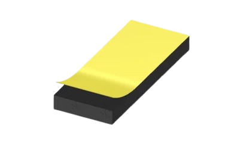
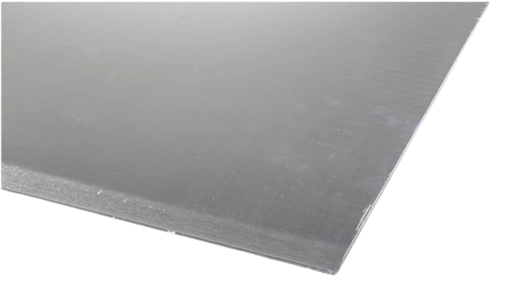
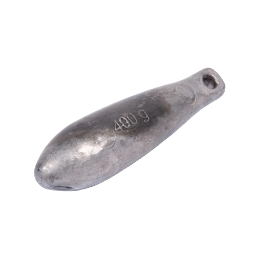
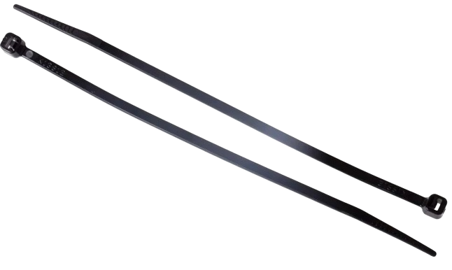
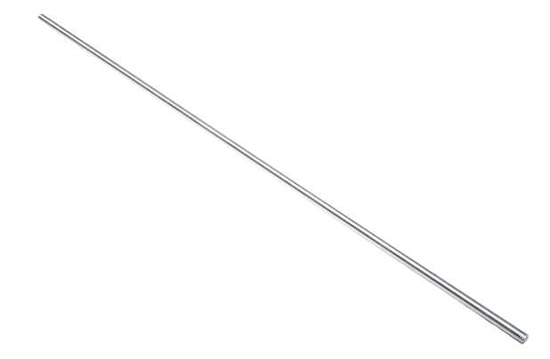
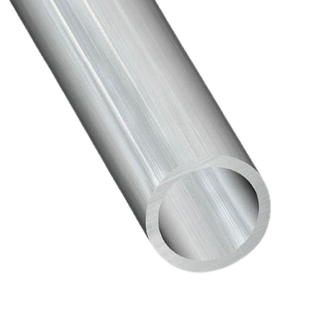

# Materiel Trepied
## Outils:

## Visserie:
| Visuel | Référence | Quantité | Dénomination | Usage | Conseil |
|-------:|-----------|----------|--------------------------|-----------------------------------------|----------|
|        |           |         1| anneau d'accroche M10 A4 |Permet d'attacher un bout au micro kosmos |          |
|        |           |         6| écrou M4                 |                                         |          |
|        |           |        10| écrou M6                 |                                         |          |
|        |           |         8| écrou nylstop  M6         |Evite au montage de se déserrer          |          |
|        |           |        12| écrou oreille M6         |                                         |          |
|        |           |        24| rondelle M6              |                                         |          |
|        |           |         4| vis M4 longueur 20mm     |                                         |          |
|        |           |         2| vis M4 longueur 40mm     |                                         |          |
|        |           |         3| vis M6 longueur 50mm     |                                         |          |
|        |           |         1| vis M10 longueur 40mm    |                                         |          |

## Pièces:
| Visuel | Référence | Quantité | Dénomination | Usage | Conseil |
|-------:|-----------|----------|--------------------------|-----------------------------------------|----------|
|   |[RS-PRO 619-1786](https://fr.rs-online.com/web/p/rubans-mousse/6191786)           |         1| mousse en ruban          |Permet d'avoir un contact parfait avec le tube plexy|          |
|   |[RS PRO 178-239](https://fr.rs-online.com/web/p/feuilles-metalliques/0178239?gb=s)           |         1| plaque métalique 30mm*100mm | protège le socle supérieur pour fixer l'anneau d'attache                                  |          |
|        |[CAPERLAN 8655063](https://www.decathlon.fr/p/plomb-maquereau-long-peche-en-mer/_/R-p-335078?mc=8655063&utm_source=google&utm_medium=sea&utm_campaign=fr_t-perf_ct-shopp_n-shopping_hm_peche_mp_ts-gen_f-cv_o-roas_pt-pb_xx-shopping_hm_peche_mp&utm_term=_n-shopping_hm_peche_mp_ts-gen_pt-pb_yy-peche_plomb&gad_source=1&gclid=EAIaIQobChMIpd3PnKLOhAMVAahoCR3GDAL-EAQYAiABEgKDmfD_BwE)         |         3| plomb maquereau 600g          | Ajoute du poids pour que le système coule et reste stable au fond de l'eau      |          |
|        |[RS PRO 233-465](https://fr.rs-online.com/web/p/serre-cables/0233465?gb=s)           |         3|serre cable 150mm  | Maintient les plombs maquereaux   |          |
|        |[RS PRO 530-321](https://fr.rs-online.com/web/p/tiges-filetees/0530321?gb=s)     |      1m50| tige filletée M6         | Permet de faire le lien entre le socle inférieur et supérieur    |          |
|        |[3232630508800](https://www.mr-bricolage.fr/tube-rond-aluminium-16x1mm-1m-brut-cqfd.html?storeID=S328&at_medium=paid&at_source=google&at_campaign=LIA_all_product_horscustom&at_adgroupname=Exlusion_de_tout_les_custom_label&at_content=3232630508800&at_temp=9055186&at_network=g&at_campaignid=19604470522&at_variant=652350492136&at_term=&gad_source=1&gclid=EAIaIQobChMI0dqDjKrOhAMVUbRoCR0_rwCEEAQYBCABEgIUFfD_BwE)           |        2m| tube alu 16*1mm          | Permettra de réaliser les pieds                  |          |

## Impression 3D:
| Visuel | Référence | Quantité | Dénomination | Usage | Conseil |
|-------:|-----------|----------|--------------------------|-----------------------------------------|----------|
|         |[Trepied_SocleInferieur](/../µKOSMOS/hardware/3Dprint_files/trepied/Trepied_SocleInferieur.stl)           |         1| partie basse             |Piece dans laquel seront fixer les pieds                                         |          |
|         |[Trepied_SocleSupérieur](/../µKOSMOS/hardware/3Dprint_files/trepied/Trepied_SocleSupérieur.stl)           |         1| partie haute             |Piece qui permettra d'attacher l'anneau d'accroche                                          |          |
|         |[Trepied_CollierInférieur](/../µKOSMOS/hardware/3Dprint_files/trepied/Trepied_CollierInférieur.stl)             |         2| Ber*               |Piece inférieur de maintient du tube étanche                                         |          |
|         |[Trepied_CollierSupérieur](/../µKOSMOS/hardware/3Dprint_files/trepied/Trepied_CollierSupérieur.stl)             |         2| fermeture du Ber   |Piece suppérieur de maintient du tube étanche                                         |          |

*Ber : correspont en marine à la charpente qui maintient un bateau en traveaux

 
 
